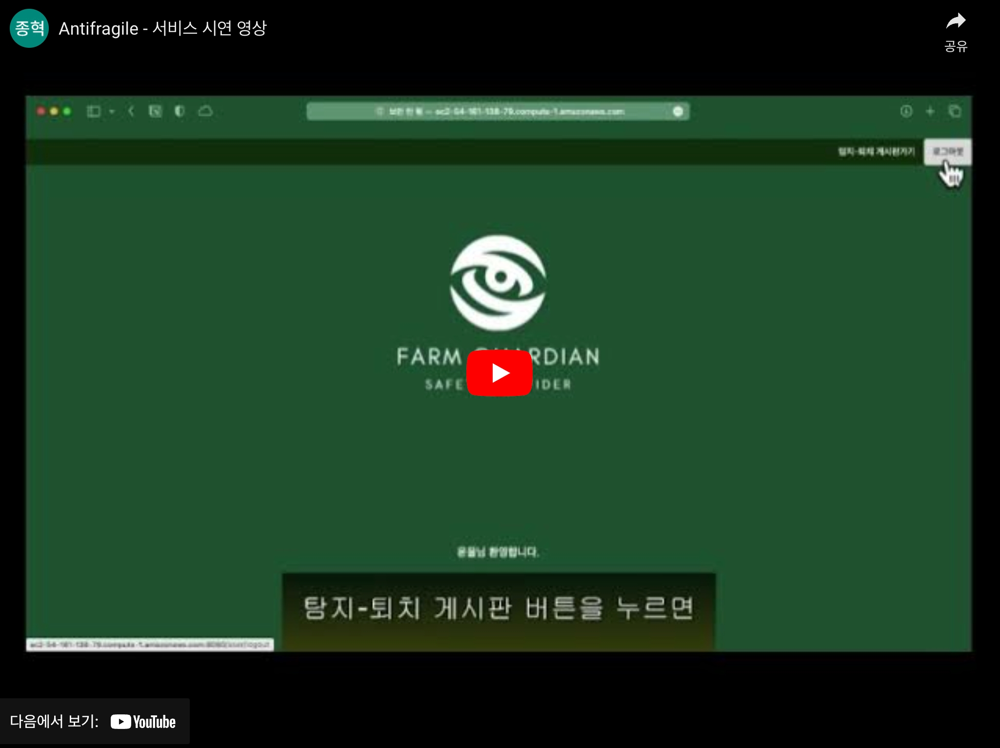

# COMPUTER VISION 기술을 이용한 유해 야생동물 탐지, 퇴치 및 경로 추적 솔루션

**ANTI-FRAGILE 팀 : 박종혁, 심재훈, 손원준, 윤율**  

## 서비스 시연 동영상

[](https://youtu.be/N_B2FDlZ5io)

<br>
<br>

## 1. 프로젝트 소개

야생동물로 인한 농가 작물 피해, 도로의 고라니 로드킬, 멧돼지에 의한 ASF 전파.  
야생동물은 장소와 시간에 따라 때론 유해동물이 되기도 합니다.  
본 프로젝트에서는 특정 야생동물을 유해동물로 지정하고, 감시지역 내 이들을 탐지하며, 위험구역에 진입시 퇴치하고, 이러한 이벤트에 대한 로그, 영상, 동영상 정보를 서비스 사용자가 볼 수 있는 솔루션을 구축했습니다.  

### ⚙️ 주요 기능  

* 야생동물 객체 탐지 기능  
* 탐지된 객체 경로 추적 기능  
* 유해동물 퇴치 기능 (가구현, 위험 범위 설정 등 가능)  
* 탐지 객체 관련 로그, 촬영 영상 및 동영상 서버 자동 업로드 기능
* 사용자 웹 서비스  


### ⚙️ 주요 기능 상세 소개  

**1. 야생동물 객체 탐지 기능**  
이미지 및 동영상 탐지에 사용되는 딥러닝 모델인 yolov7의 객체 탐지기능을 통해 웹 캠이 동작하는 동안 대상 야생동물들을 실시간으로 탐지하는 기능입니다. 야생동물의 로드킬을 방지와 ASF등과 같은 위험요소에 대한 신속한 대응을 위해 구축된 인공지능 학습용데이터를 기반으로 yolov7용 weight 값을 학습시켰습니다.  

**2. 객체 경로 추적 기능**  
탐지된 객체 바운딩박스의 중앙 하단부를 객체 위치로 정하여, 객체의 이동 경로를 화살표 선으로 표시합니다. 객체가 나타난 뒤 모두 사라지는 것을 하나의 '이벤트'로 간주하며, 이벤트에서 발생한 객체들의 이동 경로를 모두 기록하여 이미지, 로그, 비디오를 생성하여 추적된 이동 경로를 저장합니다.  

**3. 유해동물 퇴치 기능**  
유해한 동물 객체가 사용자가 설정한 위험 범위(Danger Range) 내에 진입하면 경고 알람을 재생하여 이를 내쫓습니다. 퇴치 방법은 각 객체마다 다르게 구현할 수 있지만, 현재는 가장 직관적인 경보 알람 재생 방식을 사용하고 있습니다. 위험 범위는 사용자 및 설치 환경에 따라 맞춤 설정할 수 있습니다.  

**4. 사용자 웹 서비스**  
서비스 이용자는 객체 등장 이벤트를 쉽게 볼 수 있도록 웹에서 탐지 이미지, 동영상 및 탐지 로그를 제공합니다. 더불어 최근 발생한 이벤트의 통계를 볼 수 있는 대시보드를 제공합니다.  (이벤트 : 객체가 탐지 범위에 등장할 때부터 퇴장할 때까지)  

<br>

### 🌟 기존 서비스와의 차별성  

* SORT 알고리즘을 통해 대상 객체의 이동 경로 파악  
* 감시 지역에서 일어난 이벤트를 알고리즘에 따라 묶고, AWS로 자동 전송  

<br>

### 📁 함께 보면 좋을 자료  

* 발표자료 : [발표자료.pdf](./01.%20%EB%B0%9C%ED%91%9C%EC%9E%90%EB%A3%8C_anti-fragile.pdf)  
* 프로젝트 상세내용 : [프로젝트 상세내용.xlsx](./04.%20%ED%94%84%EB%A1%9C%EC%A0%9D%ED%8A%B8%20%EC%83%81%EC%84%B8%EB%82%B4%EC%9A%A9_antifragile.xlsx)  

<br>
<br>

## 2. 사용 준비  

미리 훈련된 weight 파일을 사용하고자 하는 경우 `4.실행` 부분을 참고해주세요.  

### 2-1. 데이터셋 다운로드 (직접 훈련시)  

* 야생동물 데이터 다운로드  
https://aihub.or.kr/aihubdata/data/view.do?currMenu=115&topMenu=100&aihubDataSe=realm&dataSetSn=645  

* COCO 데이터셋  
https://public.roboflow.com/object-detection/microsoft-coco-subset  

* KAIST 야간 보행자 데이터셋  
https://soonminhwang.github.io/rgbt-ped-detection/  


### 2-2. requirements 설치  

```terminal
pip install -r ./yolov7/requirements.txt
```

<br>
<br>

## 3. Train  

모델 훈련의 자세한 사항은 훈련 코드들을 참고해주세요.  

[주야간 통합 훈련 : 야생동물만](./train/yolov7_train_%EC%95%BC%EC%83%9D%EB%8F%99%EB%AC%BC.ipynb)  
[주간 + COCO 데이터셋 훈련](./train/yolov7_train_coco%EA%B0%80%EC%A4%91%EC%B9%98%2B%EC%95%BC%EC%83%9D%EB%8F%99%EB%AC%BC4%EC%A2%85_%EC%A3%BC%EA%B0%84_%EC%A0%84%EC%9D%B4%ED%95%99%EC%8A%B5.ipynb)  
[야간 + COCO 데이터셋 훈련](./train/yolov7_train_coco%EA%B0%80%EC%A4%91%EC%B9%98%2B%EC%95%BC%EC%83%9D%EB%8F%99%EB%AC%BC4%EC%A2%85_%EC%95%BC%EA%B0%84_%EC%A0%84%EC%9D%B4%ED%95%99%EC%8A%B5.ipynb)  
[야간 + KAIST 데이터셋 훈련](./train/yolov7_train_KAIST야간보행자%2B야생동물4종_야간_일반학습.ipynb)  

<br>
<br>

## 4. 객체 탐지(detect) 코드 실행  

객체 탐지 코드를 실행시켜주세요.  
* 객체 탐지 코드 : `./yolov7/detect_or_trackmbasic_1_3_7.py`  

```terminal
-- 주간 detect 코드
python detect_or_trackmbasic_1_3_7.py --weights coco2wild4_day_31epoch_best.pt --no-trace --view-img --track --show-track --unique-track-color --danger-range 0.5 --conf-thres 0.7 --detecting-time 10 --thickness 3 --source 0 --class 1 2 3

-- 야간 detect 코드
python detect_or_trackmbasic_1_3_7.py --weights coco2wild4_night_12epoch_best.pt --no-trace --view-img --track --show-track --unique-track-color --danger-range 0.5 --conf-thres 0.7 --detecting-time 10 --thickness 3 --source 0 --class 0 1 2

```

```python
--weights : 객체 탐지에 이용할 weight 파일(가중치 파일)을 지정한다.
--source : 객체 탐지할 소스에 대한 유형을 지정. 0은 웹캠.
--save-txt : 로그정보를 기록할지에 대한 옵션. 선언시 True
--saving-img : 이미지를 저장할지에 대한 옵션. 선언시 True
--detecting-time : 객체 미탐지시 얼마의 시간 동안 이벤트 종료를 유예할 건지 설정. 단위는 초(sec)
--remove-old-track : 사라진 객체의 tracking 선을 제거합니다.
--danger-range 0.x : 객체가 화면의 x% 범위 내로 접근하면 알람이 울리도록 범위 설정 [0.0-1.0]
--conf-thres 0.y : 객체 인식 신뢰도 [0.0-1.0]
--view-img : 탐지 현황 영상을 보여준다.
--track : 객체 경로 추적을 활성화 한다.
--show-track : 객체 경로를 탐지 현황 영상에 표시한다.
--unique-track-color : 객체 경로를 서로 다른 색으로 지정한다.
```

<br>
<br>

**참고 사항**  
* AWS 연결 정보를 담고 있는 환경변수 파일(.env)는 보안상 업로드하지 않았습니다.  
* 관련 사항은 상황에 맞게 사용하는 서버로 대체되어야 합니다.  

<br>
<br>

## 5. 프로젝트 관련 기타 사항  

### 🔨 기술 스택  
- Python 3.9.0  
- Java (JDK 17)  
- Spring Boot 3.0.4  
- HTML5  
- MySQL 8.0.27  
- Maven 4.0.0  

### 👥 팀 구성원

|||||
|---|---|---|---|
|<center>박종혁(팀장)<br>* 백엔드 개발<br>* 모델-서버 연결</center>|<center>윤율<br>* 프론트엔드 개발<br>* 기획|<center>심재훈<br>* 백엔드 개발<br>* 경로추적 구현|<center>손원준<br>* 백엔드 개발<br>* 모델 학습|
|<center>whdrns2013@naver.com<br>https://github.com/whdrns2013|https://velog.io/@human_power22|https://blog.naver.com/doctorsim1|https://velog.io/@swj6446|

<br>
<br>
