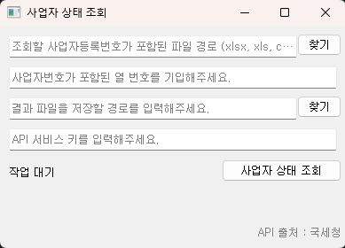

## Introduction  

사업자 상태를 조회하는 프로그램입니다.  
  

xls, xlsx, csv 등의 형식으로 저장된 파일에서 불러온 사업자의 상태를 확인하여, csv 파일로 반환합니다.  

API 서비스 키는 공공 데이터포털에서 발급받아햐 합니다.  
[공공데이터포털 - 국세청_사업자등록정보 진위확인 및 상태조회 서비스](https://www.data.go.kr/data/15081808/openapi.do#/layer-api-guide)  

**API 출처 : 국세청**  


## Download executable file  
윈도우 64비트 : [buisiness_status_win64](https://github.com/whdrns2013/lab/releases/download/v1.0.0/buisiness_status_win64.zip)  
arm64 : [buisiness_status_arm64](https://github.com/whdrns2013/lab/releases/download/v1.0.0/buisiness_status_arm64.zip)  
Unix : [buisiness_status_unix](https://github.com/whdrns2013/lab/releases/download/v1.0.0/buisiness_status_unix.zip)  

## Required Libraries

Python >= 3.10.13  
PyQt5 >= 5.15.11  
jupyterlag_server >= 2.27.3  
requests  
pyinstaller >= 6.10.0  
openpyxl >= 3.1.2  
xlrd >= 2.0.1  
chardet >= 5.2.0


## Program Build  

```cmd
pyinstaller --onefile --windowed --exclude-module numpy --exclude-module pandas --exclude-module pyexcel buisiness_status.py
```