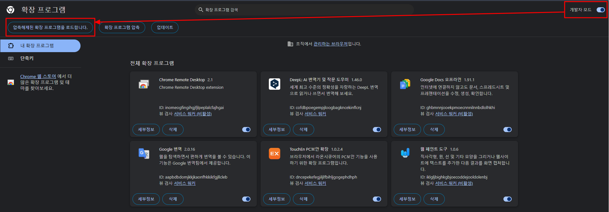
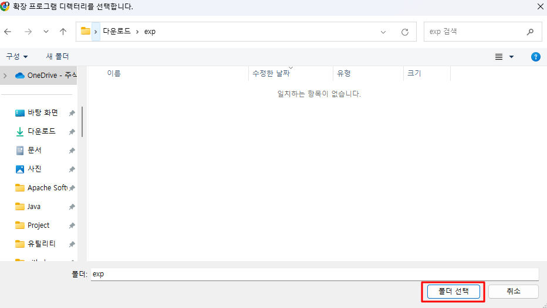
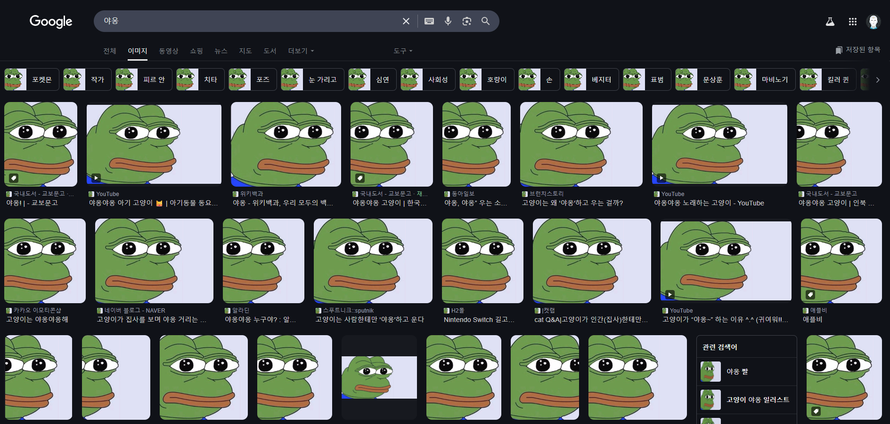

## exp  

### 설명  

- 친구 브라우저에 장난치기  
- 친구 브라우저에 띄워지는 이미지를 모두 페페 이미지로 만들어봅시다.  
- 일단 친구 컴퓨터를 탈취부터 해야합니다.  

## 세팅 가이드  

### 빠른 시작  

- 구글 크롬 -> 확장 프로그램 메뉴  
- 압축해제된 확장 프로그램을 로드합니다.  

  

- 본 폴더를 선택하고 "폴더 선택"  

  

- 완성  

  

### 커스터마이징  

#### 이미지 변경  

- index.js 에서 `a.src` 의 값을 원하는 이미지로 변경    

```javascript
setInterval(()=> {

	let imgs = document.querySelectorAll('img');
	imgs.forEach((a, i)=>{
		a.src = 'https://i.kym-cdn.com/entries/icons/original/000/017/618/pepefroggie.jpg' // 여기
	})

}, 100)
```

#### 재실행 인터벌 수정  

- index.js 에서 `setInterval` 의 두 번째 파라미터를 원하는 간격으로 변경    
- ms 단위임  

```javascript
setInterval(()=> {

	let imgs = document.querySelectorAll('img');
	imgs.forEach((a, i)=>{
		a.src = 'https://i.kym-cdn.com/entries/icons/original/000/017/618/pepefroggie.jpg' // 여기
	})

}, 100)
```
